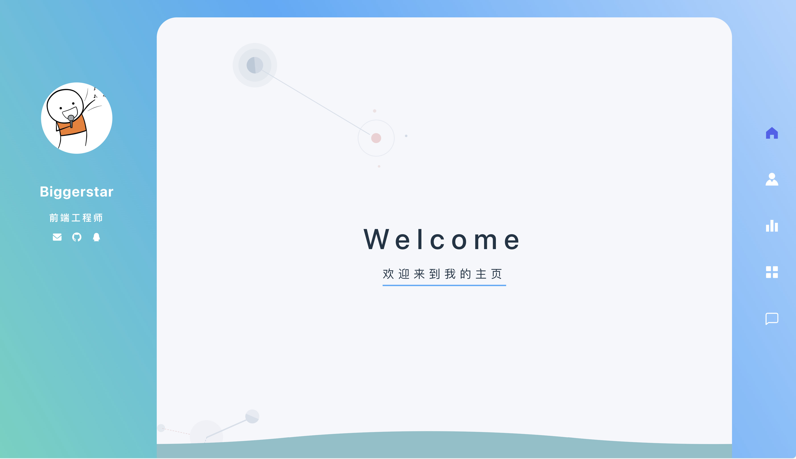
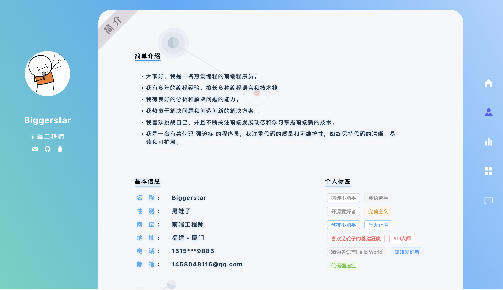
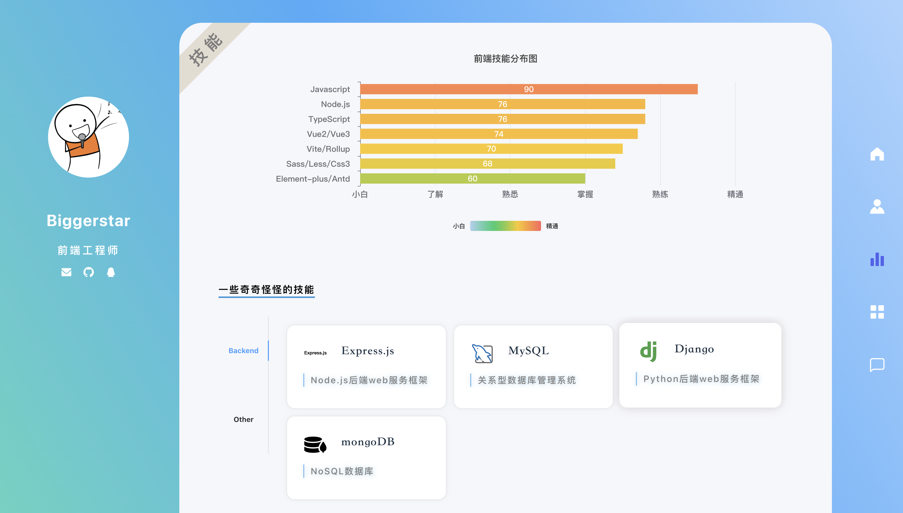
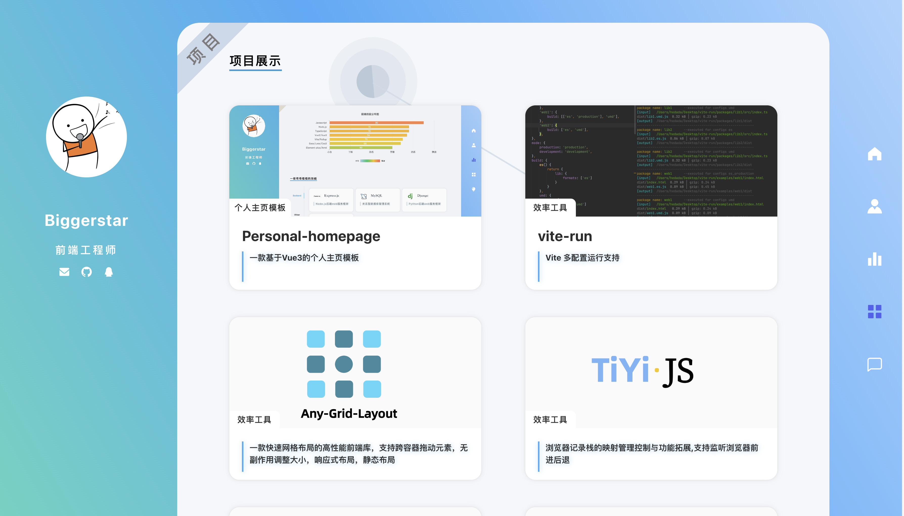
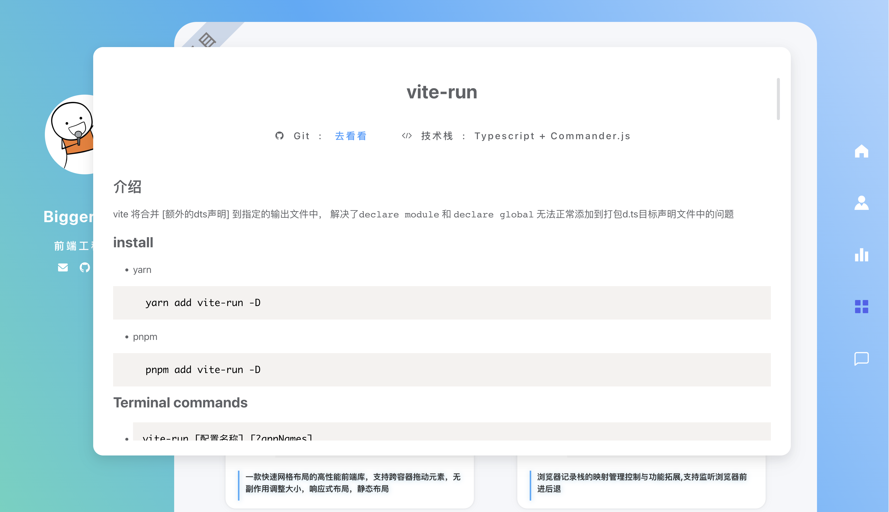
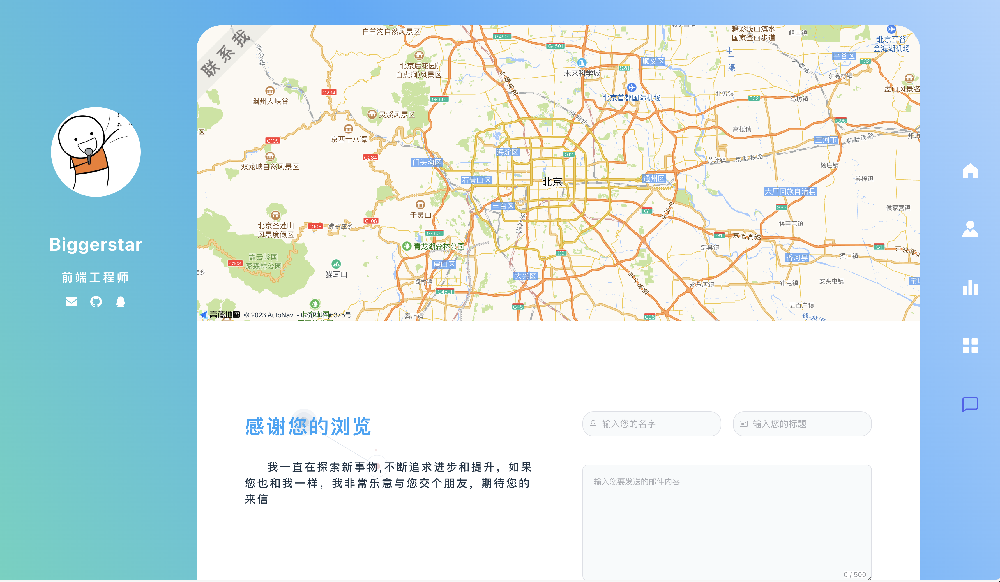

<h1 align="center">personal-homepage</h1>
 

这是基于一款vue3开发的简历模板
模板有各种丰富的展示功能和清爽的界面,交互动画也很丝滑

### 介绍

模板里面所有可以看见的文字,数据，图标
都可以通过`config.ts`配置文件进行配置，
项目详情页可以配置md文档进行加载，支持高亮代码块

### 以下是页面展示示例

- 欢迎页
  

- 介绍页
  

- 技能页
  

- 项目页
  

- 项目详情文章页(支持加载md文档)
  

- 联系站长页
  

